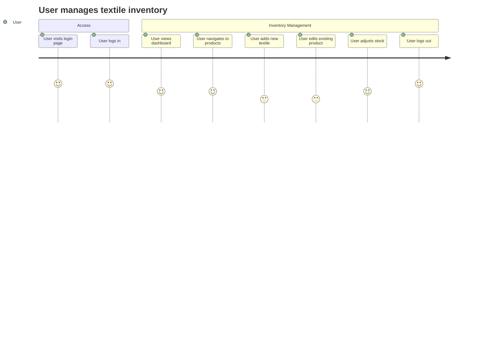

# Textile Inventory Frontend

## Introduction

Textile Inventory Frontend is a modern web application interface for managing textile inventory efficiently. The project is designed to provide an intuitive and responsive experience for users to track, update, and analyze textile stock. It is part of a larger inventory management ecosystem often paired with a backend service.

## Features

- User authentication and authorization
- Dashboard with real-time inventory statistics
- Product CRUD (Create, Read, Update, Delete) operations
- Category and supplier management
- Advanced search, filtering, and sorting
- Stock adjustments and transaction history
- Responsive design for desktop and mobile devices
- API integration for seamless data synchronization

## Requirements

Before installing, ensure you have the following prerequisites:

- Node.js (version 16.x or higher recommended)
- npm or yarn package manager
- Modern web browser (for usage)
- Access to the Textile Inventory Backend API (for full functionality)
- Git (for cloning the repository)

## Installation

Follow these steps to set up the Textile Inventory Frontend locally:

1. **Clone the repository:**
   ```bash
   git clone https://github.com/rafahfj/textile-inventory-frontend.git
   ```
2. **Navigate to the project directory:**
   ```bash
   cd textile-inventory-frontend
   ```
3. **Install dependencies:**
   ```bash
   npm install
   ```
   or, if you prefer yarn:
   ```bash
   yarn install
   ```
4. **Configure environment variables for API endpoints and other settings (see Configuration section).**

5. **Start the development server:**
   ```bash
   npm start
   ```
   or
   ```bash
   yarn start
   ```
6. Open your browser and visit `http://localhost:3000` to access the application.

## Usage

Once installed and running, you can interact with the Textile Inventory system as follows:

- **Login:** Authenticate using your credentials.
- **Dashboard:** View key statistics and recent inventory changes.
- **Products:** Add, update, or remove textile products.
- **Categories and Suppliers:** Organize and maintain related entities.
- **Search and Filter:** Use built-in tools to quickly locate inventory items.
- **Stock Adjustments:** Record incoming and outgoing stock movements.
- **Reports:** Generate and export inventory summaries (if available).

### Example User Journey



## Configuration

Configuration is managed via environment variables. Create a `.env` file in the project root and define the following (example values shown):

```
REACT_APP_API_BASE_URL=https://api.yourdomain.com
REACT_APP_AUTH_ENABLED=true
REACT_APP_FEATURE_REPORTS=true
```

- `REACT_APP_API_BASE_URL`: The base URL for the backend API.
- `REACT_APP_AUTH_ENABLED`: Set to `true` to require login.
- `REACT_APP_FEATURE_REPORTS`: Enable or disable reporting features.

Change these values as needed to suit your environment.

## Contributing

We welcome contributions! To get started:

- Fork the repository
- Create a new branch for your feature or bugfix
- Write clear, concise commit messages
- Submit a pull request with a detailed description

Please ensure your code adheres to the existing style and includes relevant tests. For large changes, open an issue first to discuss your proposal.

---

Thank you for using Textile Inventory Frontend. For questions or support, please contact the repository maintainer or create an issue on GitHub.
